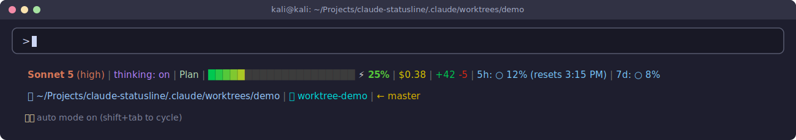

# claude-statusline

A custom two-line truecolor statusline for [Claude Code](https://claude.com/claude-code), plus
one-command installers for Linux, macOS, and Windows.

## What it shows

**Line 1:** model + effort · thinking mode · output style · context-usage bar · session cost ·
code velocity (+added/-removed) · 5-hour and 7-day rate limits (with local reset time)

**Line 2:** current directory · current git branch (or, in a worktree session, the worktree name
and its original branch)

### Normal session


*(The `⏵⏵ auto mode on` line is Claude Code's own UI, not something this script prints — shown
just for context on how it all looks together.)*

### Inside a Claude Code worktree session



When a session uses Claude Code's worktree-isolation feature (the `EnterWorktree` tool — an
isolated checkout on its own branch, used for parallel/experimental work), line 2 swaps the plain
branch name for the worktree's name and the branch it originally forked from.

## Install

**Linux / macOS**
```sh
git clone https://github.com/GoSlowPoke168/claude-statusline.git
cd claude-statusline
./install.sh
```

**Windows**
```powershell
git clone https://github.com/GoSlowPoke168/claude-statusline.git
cd claude-statusline
powershell -ExecutionPolicy Bypass -File install.ps1
```
Uses a native PowerShell port of the script — no Git for Windows, `bash.exe`, or `jq` required.
Only `git.exe` is needed, and only for the branch segment; everything else works without it.

**Running Claude Code inside WSL instead of natively?** Use the Linux instructions above from
inside your WSL distro.

Restart Claude Code (or start a new session) after installing, either way.

## What the installer does

1. Copies the statusline script (`statusline-command.sh` or `.ps1`) to `~/.claude/` (or
   `$CLAUDE_CONFIG_DIR` if you've set that env var).
2. **Linux/macOS only:** makes sure `jq` is installed, via your platform's package manager if
   it's missing (`apt`/`dnf`/`yum`/`pacman`/`zypper`/`brew`).
3. Merges a `statusLine` key into `settings.json` — it only touches that one key, so any other
   settings you already have are left alone.

## Requirements

- **Linux/macOS:** bash, jq (auto-installed if missing).
- **Windows:** nothing beyond PowerShell itself (built into every Windows install). `git.exe`
  is only needed for the branch segment to resolve — install it however you like (Git for
  Windows, winget, scoop, etc.), bash is never invoked.

## Notes

- The bash version uses GNU `date -d`, with a fallback to BSD `date -r` for macOS, to render
  local rate-limit reset times.
- To customize colors or layout, edit `statusline-command.sh` (Linux/macOS) or
  `statusline-command.ps1` (Windows) directly, then re-run the installer to redeploy it.
- The two scripts are kept in sync by hand — if you change one, mirror the change in the other.
